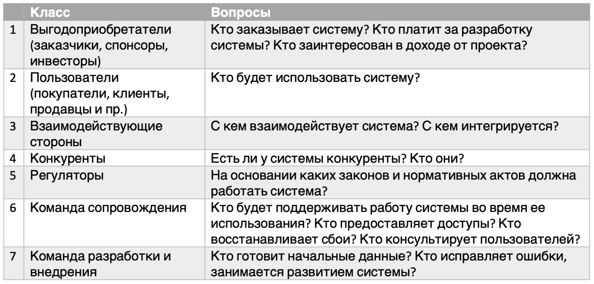
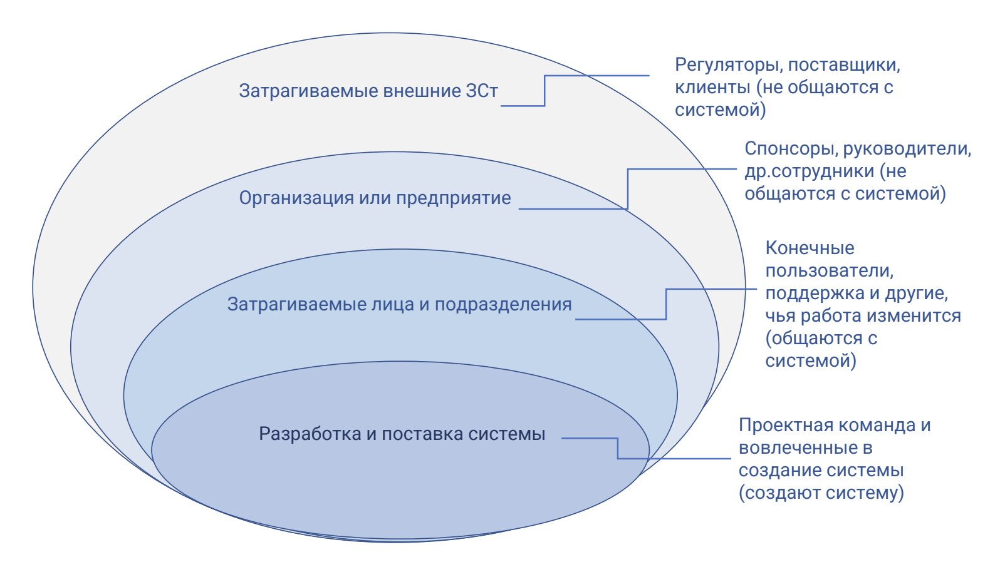
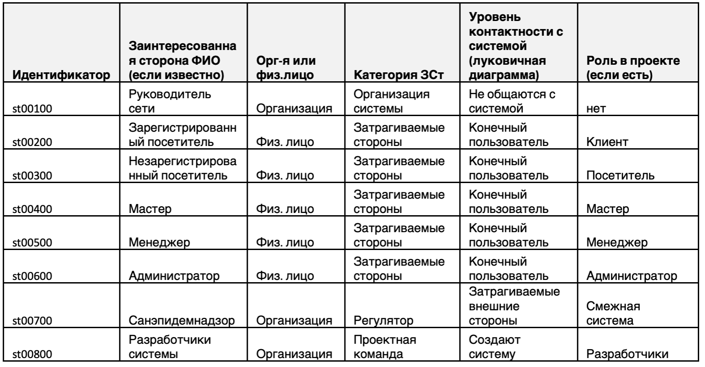
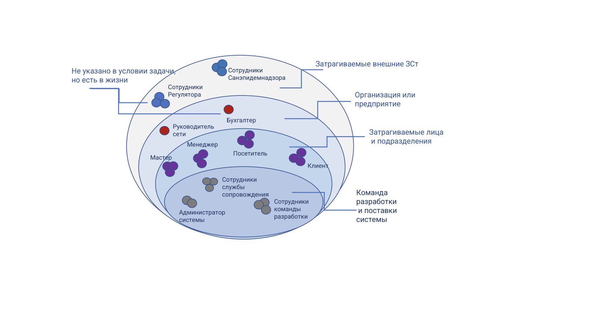
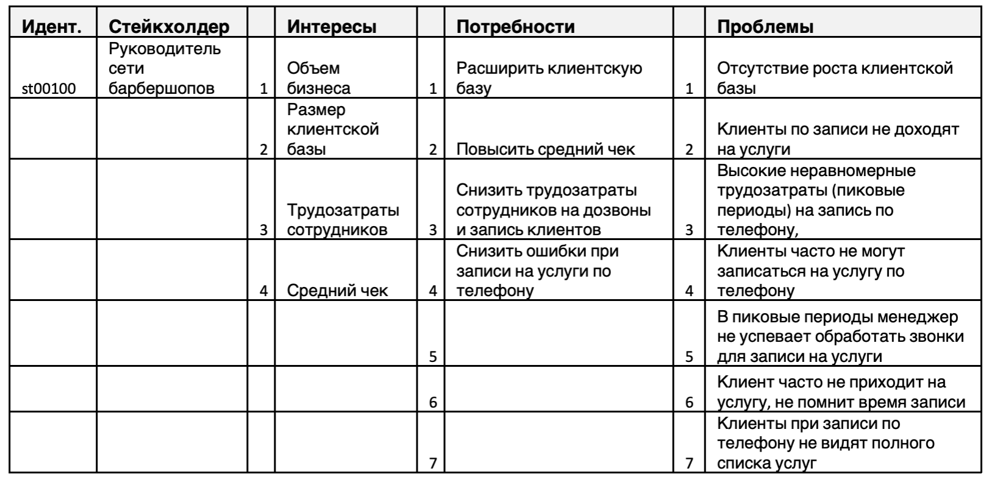

# Project Name

Description

## Contents

1. [Chapter I](#chapter-i) \
    1.1. [Preamble](#preamble)
2. [Chapter II](#chapter-ii) \
    2.1. [General rules](#general-rules)
3. [Chapter III](#chapter-iii) \
    [Theory](#theory)  
    3.1. [Заинтересованные стороны](#заинтересованные-стороны)  
    3.2. [Кто заинтересован в системе?](#кто-заинтересован-в-системе-?)  
    3.3. [Роли](#роли)  
    3.4. [Каталог заинтересованных сторон](#каталог-заинтересованных-сторон)  
    3.5. [Луковичная диаграмма](#луковичная-диаграмма)  
4. [Chapter IV](#chapter-iv) \
    4.1. [Задача 1](#задача-1)  
    4.2. [Задача 2](#задача-2)
5. [Chapter V](#chapter-v) \
    5.1. [Exercise 00](#exercise-00)  
    5.2. [Exercise 01](#exercise-01)  
    5.3. [Exercise 02](#exercise-02)  
    5.4. [Exercise 03](#exercise-03)  

<h2 id="chapter-i" >Chapter I</h2>
<h2 id="preamble">Preamble</h2>  
Любая система (промышленная, интеллектуальная, культурная или ИТ) строится в интересах кого-то, для удовлетворения чьих-то потребностей. Полезно помнить слова Тома Гилба: «Стейкхолдеров всегда на одного больше, чем вы знаете, а те, которых вы знаете, имеют минимум на одну потребность больше, чем вам сейчас известно». В этом проекте вы узнаете, как выявлять заинтересованные стороны и их потребности.  

Литература: 
1. Карл Вигерс «Разработка требований к программному обеспечению» издание третье     
2. BABOK v3 «Руководство к своду знаний по бизнес-анализу» IIBA
3. [Cтейкхолдеры: зона особого внимания](https://habr.com/ru/post/127630/)  
4. [Кто такие стейкхолдеры и как ими управлять](https://blog.calltouch.ru/stejkholdery-kto-eto-takie-kakie-byvayut-vidy-stejkholderov-proekta/)

<h2 id="chapter-ii" >Chapter II</h2>
<h2 id="general-rules">General rules</h2>

1. Всю дорогу вас будет сопровождать чувство неопределенности и острого дефицита информации: это нормально. Не забывайте, что информация в репозитории и Google всегда с вами. Как и пиры, и Slack. Общайтесь. Ищите. Опирайтесь на здравый смысл. Не бойтесь ошибиться.  
2. Будьте внимательны к источникам информации. Проверяйте. Думайте. Анализируйте. Сравнивайте.   
3. Будьте внимательны к тексту задания. Перечитайте несколько раз.   
4. Читайте примеры внимательно. В них может быть что-то, что не указано в явном виде в самом задании.  
5. Вам могут встретиться несоответствия, когда что-то новое в условиях задачи или примере противоречит уже известному. Если встретилось такое — попробуйте разобраться. Если не получилось — запишите вопрос в открытые вопросы и выясните в процессе работы. Не оставляйте открытые вопросы неразрешенными.   
6. Если задание кажется непонятным или невыполнимым — так только кажется. Попробуйте его декомпозировать. Скорее всего, отдельные части станут понятными.   
7. На пути вам встретятся разные задания. Те, что помечены звездочкой (*) — подходят для более дотошных. Они с повышенной сложностью и не обязательны к выполнению. Но если вы их сделаете, то получите дополнительный опыт и знания.  
8. Не пытайтесь обмануть систему и окружающих. В первую очередь вы обманете себя.  
9. Есть вопрос? Спроси своего соседа справа. Если это не помогло — соседа слева.  
10. Когда пользуетесь помощью — всегда разбирайтесь до конца: почему, как и зачем. Иначе помощь не будет иметь смысла.  
11. Всегда делайте push только в ветку develop! Ветка master будет проигнорирована. Работайте в директории src.  
12. В вашей директории не должно быть иных файлов, кроме тех, что обозначены в заданиях.  

<h2 id="chapter-iii">Chapter III</h2>
<h2 id="theory">Theory</h2>
<h2 id="заинтересованные-стороны">Заинтересованные стороны</h2>

Если система не приносит ценность тому, в чьих интересах она создается/изменяется, то она не нужна. Поэтому первый вопрос, на который нужно ответить:   

<h2 id="кто-заинтересован-в-системе-?">Кто заинтересован в системе?</h2>

Люди или организации, так или иначе заинтересованные в системе, называются заинтересованными сторонами (стейкхолдерами).  
Заинтересованные стороны — одно из ключевых понятий бизнес-анализа. Выявлению заинтересованных сторон и их потребностей, а также формированию требований для удовлетворения этих потребностей посвящена значительная часть бизнес-анализа в ИТ.  

**Заинтересованные стороны (стейкхолдеры)** — это группа лиц и/или один человек, которые могут:    
- влиять на систему; 
- оказаться под влиянием системы; 
- считать себя затронутыми системой; 
- повлиять на выбор путей реализации системы.  

То есть заинтересованные стороны — это все, кого так или иначе затрагивает система или кто думает, что система затрагивает их интересы. А также те, кто воздействует на систему или может воздействовать на нее. Это влияние и воздействие может быть как в процессе разработки, так и в процессе использования системы.
Поэтому важно выявить стейкхолдеров (отдельных лиц или группы) и определить их потребности. Выделить требования, которые позволят системе удовлетворить эти потребности.    

В группы стейкхолдеров могут входить:  
1. Те, кто заказывает и оплачивает проект: собственники, инвесторы, заказчики;   
2. Те, кто производит или предоставляет товары или услуги для дальнейшего распространения или применения системой: поставщики, посредники, производители;  
3. Те, кто получает товары или услуги посредством системы: покупатели, клиенты;  
4. Те, кто задает и проверяет нормативы и правила для работы системы, регуляторы: органы власти или общественные институты;  
5. Конкуренты — они не всегда заинтересованы в том, чтобы система работала или работала хорошо, и потому могут отрицательно повлиять на ее создание и работу;  
6. Те, кто поддерживает систему в рабочем состоянии и оказывает помощь пользователям системы: администраторы, специалисты сопровождения.  

Существует много техник работы с заинтересованными сторонами. В этом проекте рассмотрим:    
1. Каталог (список) заинтересованных сторон;  
2. Луковичная диаграмма.  

<h2 id="роли">Роли</h2>  

Каждая из перечисленных групп определяется своими интересами по отношению к нашей системе.   
Некоторые из стейкхолдеров могут быть объединены в группы, т.к. выполняют в системе одинаковые функции. Такие группы называют ролью (проектная роль, роль в проекте).    
Роль называется по основной выполняемой ею функции. Например, человек, выбирающий товар, откладывающий его в корзину, оплачивающий и получающий его тем или иным способом — покупатель.   
Не рекомендуется называть проектную роль обобщенными названиями, собирающими несколько ролей, в том числе выполняющих разные функции (например, пользователь), если есть отдельные группы, выполняющие в системе разные функции: покупатели, продавцы, товароведы, бухгалтеры.   
Каждая заинтересованная сторона (организация или человек) может выполнять несколько ролей, например, заказчик может быть одновременно поставщиком, т.е. если поставщик товаров/услуг заказал систему для продвижения своего товара/услуги, он является и заказчиком, и поставщиком. И одну роль могут выполнять несколько заинтересованных сторон (т.е. иметь один и тот же интерес, выполнять одни и те же функции в системе).   
А иногда физическое лицо (и даже организация) под влиянием обстоятельств могут изменить свои интересы и выполняемые действия, т.е. сменить свою роль в проекте.  

<h2 id="каталог-заинтересованных-сторони">Каталог заинтересованных сторон</h2>    

Чтобы выявить все возможные источники требований и не потерять их потребности, в процессе построения системы следует создать и вести каталог заинтересованных сторон. Стейкхолдеры могут быть выявлены не только в начале работы над проектом, но и позже. Актуальный каталог стейкхолдеров нужен на всем протяжении проекта, чтобы не потерять важного стейкхолдера. В списке могут быть как пользователи системы, так и заинтересованные в системе, но не работающие с ней.  
Для анализа значимости стейкхолдеров для проекта и выбора способов работы с ними рекомендуется в каталог собирать такие характеристики:  
1. ФИО (если известно);  
2. Контактная информация (телефон, e-mail, ник в соц.сети, где договорились общаться);  
3. Организация/компания;  
4. Должность/позиция;  
5. Локация;  
6. Роль в проекте (если понятно);  
7. Масштабируемость роли (один/ примерное количество);  
8. Ответственность в проекте (за что отвечает);  
9. Уровень полномочий в проекте (что уполномочен делать /решать);  
10. Предыдущий опыт, полезный проекту;  
11. Дату добавления стейкхолдера в каталог.  

В случае небольшого проекта достаточно выбрать 2-4 характеристики, которые помогут вам в работе с заинтересованными сторонами, например, чтобы разложить стейкхолдеров по областям луковичной диаграммы (см. раздел 5.Луковичная диаграмма) и для определения роли пользователей в системе.   
Есть несколько вопросов, которые помогут выявить заинтересованные стороны.     

Таблица 1. Группы заинтересованных сторон и вопросы для их выявления  
.   

<h2 id="луковичная-диаграмма">Луковичная диаграмма</h2>   

Луковичная диаграмма помогает выявить заинтересованные стороны, определить их отношение к продукту и способствует выявлению их интересов и потребностей. На диаграмме элементы (стейкхолдеры и группы стейкхолдеров) отображаются в концентрических кругах, элементы в каждом круге находятся в равном удалении от системы: взаимодействуют с ней, зависят от нее (пользуются результатами или данными), являются внешними к системе, но взаимодействующими с ней (получающими или передающими ей информацию).   

<h2 id="chapter-iv">Chapter IV</h2> 
<h2 id="задача-1">Задача 1. Запись на стрижку (Sign up for a haircut)</h2>  

Руководство сети барбершопов приняло решение о внедрении системы, обеспечивающей онлайн-запись на прием. Основная цель — развитие бизнеса путем расширения клиентской базы за счет возможности онлайн-записи, а также снижение трудозатрат сотрудников и уменьшение ручного труда за счет автоматического информирования клиентов по каналам связи.   

Запись может осуществлять как зарегистрированный, так и незарегистрированный посетитель сайта. При записи можно выбрать тип услуги: парикмахерские или косметологические, а также саму услугу, мастера и время из свободных интервалов. Система должна обеспечивать автоматическую отправку напоминаний клиентам через выбранный клиентом канал связи (тг, вотсап, vk, смс) по настроенному менеджером расписанию. После получения услуги система предлагает клиенту оценить услугу и написать предложения по улучшению работы.  

Расписание мастеров и выполняемые каждым мастером услуги должен вводить менеджер, возможно это будет не один человек. Он же отвечает за актуальность расписания и при необходимости корректирует его, осуществляет связь с клиентами в ручном режиме, проставляет отметку о выполнении услуги, начисляет и принимает оплату, передает данные об оплате в бухгалтерию. Также менеджер может получать отчеты о выполненных услугах и просматривать отзывы клиентов.  

Кроме того, система должна обеспечить учет санитарной обработки помещения каждого барбешопа, как того требуют нормы Санэпидемнадзора. Расписание санобработки вносит менеджер, он же проставляет отметку о выполнении после санобработки техническим работником.  
Любой мастер имеет возможность посмотреть расписание и запись на свои услуги, отзывы клиентов.   
  

<h2 id="задача-2">Задача 2. Доставка заказов (Delivery of orders)</h2>  

В локдаун многие продуктовые магазины и предприятия питания резко увеличили объемы онлайн-продаж, и возросла потребность в быстрой доставке мелких партий товаров индивидуальным клиентам. Компания студентов собрались и решила создать стартап службы доставки. Идея состоит в том, чтобы оперативно получать информацию о заказах, месте и сроке комплектации, месте доставки, желаемых сроках доставки и раздавать инфо курьерам, которые будут получать заказ в месте комплектации и доставлять в место доставки.   

Решили развернуть онлайн-систему, куда стекаются заказы и откуда курьеры оперативно разбирают заказы для выполнения. На первом этапе решили собирать заказы от магазинов и предприятий питания любым доступным способом и вводить в систему в едином формате силами оператора, но разработать мобильное приложение для курьеров. Курьер должен иметь возможность просматривать информацию о заказах, выбирать заказ из свободных, бронировать его, забирать в точке выдачи и доставлять  клиенту. Результат своих действий курьер должен оперативно отражать в системе через мобильное приложение. 

Также в системе должен работать диспетчер, который контролирует курьеров и при необходимости переназначает заказы. Информация о поступивших заказах должна направляться в бухгалтерию (в другую ИТ-систему) для расчета с поставщиками заказов за доставку. Также в бухгалтерию должна направляться информация о доставке заказа, где будет производиться расчет оплаты курьеров. Начисленная оплата должна передаваться в систему и отражаться в личном кабинете курьера. И еще запланировано рабочее место администратора, регистрирующего курьеров и назначающего всем права доступа.

<h2 id="chapter-v">Chapter V</h2>   

<h2 id="exercise-00">Exercise 00. Identification of stakeholders (Выявление заинтересованных сторон)</h2>  

**Для задачи 2:**   

1. Создать каталог заинтересованных сторон.   
2. Указать в каталоге заинтересованные стороны.  
3. Определить характеристики каталога — категории, по которым будут классифицироваться стейкхолдеры каждой задачи. Указать характеристики, известные из условий задачи.  
4. Указать ваши ответы в turn-in файле ex00_<префикс продукта>_stakeholders.xlsx.  

**Рекомендации по выполнению задания:**    
1. Выберите категории, которые понадобятся вам для:
   a. Категоризации по областям луковичной диаграммы для работы в дальнейшем;  
   b. Выявления ролей в системе.  
2. Категории каталога выбирайте с учетом контекста задачи. Можно принять во внимание список групп стейкхолдеров, описанный в разделе “Кто заинтересован в системе?”   
3. Укажите в каталоге заинтересованные стороны.   
4. Проставьте категории, вытекающие из условий задачи.   
5. УУкажите дату добавления стейкхолдера в каталог. В качестве даты добавления стейкхолдера в каталог следует указывать номер проекта, выполняя который он был добавлен (Пример: Day 01).   
6. Пример части каталога заинтересованных сторон по задаче 1 в таблице ниже.  

**Каталог заинтересованных сторон** на примере задачи 1

  

<h2 id="exercise-01">Exercise 01. Building a Stakeholder Onion Diagram (Построение луковичной диаграммы)</h2>  

**Для задачи 2:**  

1. Определить категории стейкхолдеров относительно взаимодействия с нашей системой (слои луковичной диаграммы). Одну из категорий определить как признаки слоев луковичной диаграммы.  
2. Определить заинтересованные стороны или группы (роли), относящиеся к каждой категории (слою).   
3. Построить луковичную диаграмму, указать на луковичной диаграмме слои и заинтересованные стороны, относящиеся к каждому слою.  
4. На луковичной диаграмме дополнительно указать те заинтересованные стороны, которые не указаны в задаче, но могут встретиться в жизни.   
5. При выявлении стейкхолдеров, которые не отражены в каталоге, добавить их в каталог из Ex. 00.  
6. Указать ваши ответы в turn-in файле ex01_<префикс продукта>_onion.xxx (xxx — расширение).   

**Рекомендации по выполнению задания:**
Постройте луковичную диаграмму. Пример луковичной диаграммы для задачи 1:  

<h2 id="exercise-02">Exercise 02. Interests, needs, problems of stakeholders (Интересы, потребности, проблемы заинтересованных сторон)</h2> 

**Для каждой задачи:**  
1. Выписать в таблицу интересы, потребности, проблемы заинтересованных сторон (в том числе внешних).  
2. Указать ваши ответы в turn-in файле ex02_<префикс продукта>needs.xlsx.  

**Рекомендации по выполнению задания:**  
Пример описания интересов, потребностей, проблем ключевого стейкхолдера для задачи 1 приведен в таблице.

<h2 id="exercise-03">Exercise 03. Building a glossary (Наполнение глоссария)</h2>   

**Для каждой задачи:**   
1. Выписать новые понятия и термины, встретившиеся в задаче, в глоссарий.  
2. Найти описание понятий и терминов и занести их в глоссарий.   
3. Указать ваши ответы в turn-in файле ex03_<префикс продукта>glossary.xlsx.  
