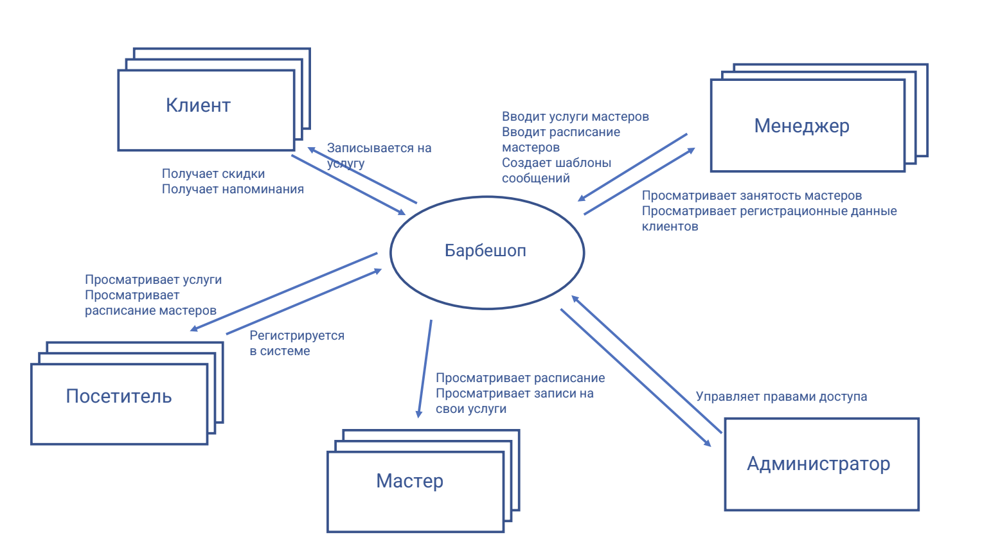

# Project Name

Description

## Contents

1. [Chapter I](#chapter-i) \
    1.1. [Preamble](#preamble)
2. [Chapter II](#chapter-ii) \
    2.1. [General rules](#general-rules)
3. [Chapter III](#chapter-iii) \
    [Theory](#theory)  
    3.1. [Виды требований, уровни требований](#виды-требований,-уровни-требований)  
    3.2. [Модели as is и to be](#модели-as-is-и-to-be)  
    3.3. [Контекстная диаграмма](#контекстная-диаграмма)    
4. [Chapter IV](#chapter-iv) \
    4.1. [Задача 1. Запись на стрижку (Sign up for a haircut)](#задача-1.-запись-на-стрижку-(sign-up-for-a-haircut))  
    4.2. [Задача 2. Доставка заказов (Delivery of orders)](#задача-2.-доставка-заказов-(delivery-of-orders))
5. [Chapter V](#chapter-v) \
    5.1. [Exercise 00](#exercise-00)  
    5.2. [Exercise 01](#exercise-01)  
    5.3. [Exercise 02](#exercise-02)  
    5.4. [Exercise 03](#exercise-03)  
    5.5. [Exercise 04](#exercise-04)  

<h2 id="chapter-i" >Chapter I</h2>
<h2 id="preamble">Preamble</h2>

Требование — это пригодное для практического использования представление потребности или решения. В этом проекте вы узнаете о классификации требований, которые с разных сторон описывают систему. И о том, как и почему требования связаны друг с другом. Научитесь строить контекстную диаграмму.   

**Литература:**. 
1. Карл Вигерс, Джой Битти «Разработка требований к программному обеспечению» издание третье, глава 1 и другие. 
2. BABOK v3 «Руководство к своду знаний по бизнес-анализу» IIBA. 
3. Дин Леффингугуэлл, Дон Уидриг «Принципы работы с требованиями к программному обеспечению», часть 1, глава 4.  
4. Элизабет Халл, Кен Джексон, Джереми Дик “Инженерия требований”.  
5. Илья Корнипаев “Требования для программного обеспечения: рекомендации по сбору и документации”.  

<h2 id="chapter-ii" >Chapter II</h2>
<h2 id="general-rules">General rules</h2>  

1. Всю дорогу вас будет сопровождать чувство неопределенности и острого дефицита информации: это нормально. Не забывайте, что информация в репозитории и Google всегда с вами. Как и пиры, и Slack. Общайтесь. Ищите. Опирайтесь на здравый смысл. Не бойтесь ошибиться.  
2. Будьте внимательны к источникам информации. Проверяйте. Думайте. Анализируйте. Сравнивайте.   
3. Будьте внимательны к тексту задания. Перечитайте несколько раз.   
4. Читайте примеры внимательно. В них может быть что-то, что не указано в явном виде в самом задании.  
5. Вам могут встретиться несоответствия, когда что-то новое в условиях задачи или примере противоречит уже известному. Если встретилось такое — попробуйте разобраться. Если не получилось — запишите вопрос в открытые вопросы и выясните в процессе работы. Не оставляйте открытые вопросы неразрешенными.   
6. Если задание кажется непонятным или невыполнимым — так только кажется. Попробуйте его декомпозировать. Скорее всего, отдельные части станут понятными.   
7. На пути вам встретятся разные задания. Те, что помечены звездочкой (*) — подходят для более дотошных. Они с повышенной сложностью и не обязательны к выполнению. Но если вы их сделаете, то получите дополнительный опыт и знания.  
8. Не пытайтесь обмануть систему и окружающих. В первую очередь вы обманете себя.  
9. Есть вопрос? Спроси своего соседа справа. Если это не помогло — соседа слева.  
10. Когда пользуетесь помощью — всегда разбирайтесь до конца: почему, как и зачем. Иначе помощь не будет иметь смысла.  
11. Всегда делайте push только в ветку develop! Ветка master будет проигнорирована. Работайте в директории src.  
12. В вашей директории не должно быть иных файлов, кроме тех, что обозначены в заданиях.  

<h2 id="chapter-iii">Chapter III</h2>
<h2 id="theory">Theory</h2>
<h2 id="виды-требований,-уровни-требований">Виды требований, уровни требований</h2>

Требования — это описание потребностей того, что должно быть реализовано. В них описано поведение системы, ее свойства, характеристики и ограничения. Требования описывают систему во всех ее проявлениях, со всех сторон. 
Наиболее применяемая типизация требований приведена в книге К.Вигерса и Д.Битти “Разработка требований к программному обеспечению”, таблица ниже.   

**Виды требований**

Требования разных видов к одному программному продукту всегда связаны, зависят друг от друга, влияют друг на друга. Взаимосвязи требований и их уровни изображены на рисунке 1 — приведено из книги К.Вигерса, Д.Битти «Разработка требований к программному обеспечению» издание третье, глава 1. Но следует понимать, что на одном уровне, под единым понятием, например, пользовательских требований, собраны требования от разных групп пользователей (разных ролей), и в том числе могут оказаться противоположные по предпочтениям требования.  

Рисунок 1.

<h2 id="модели-as-is-и-to-be">Модели as is и to be</h2>  

As is — модель текущего состояния системы или организации. Показывает протекающие в настоящем процессы, объекты, роли и действия. Целью построения модели as is является выявление текущего состояния и проблемных мест в текущем состоянии. На основе модели as is мы должны понять, что следует сделать для решения проблемы и построить модель to be —  предполагаемое состояние будущей системы и/или изменение процессов и/или самой системы. И далее — определить порядок перехода от текущего к будущему состоянию системы.  

<h2 id="контекстная-диаграмма">Контекстная диаграмма</h2>

Контекстная диаграмма характеризует текущую (существующую) или будущую (предполагаемую) систему в ее связях с окружающим миром — стейкхолдерами и смежными системами. Она отображает, какие потоки информации или управляющие воздействия передаются извне внутрь системы, а какие из системы наружу, и кто их передает. Контекстная диаграмма не показывает что делается внутри системы, только “черный ящик”. А еще она помогает определить границы системы.  

**Описание**. 
Диаграмма показывает в каком окружении (предметной области, контексте) существует система, что и кто ее окружает и взаимодействует с ней. В первую очередь, это пользователи системы (в разных ролях) и внешние системы, обменивающиеся с ней информацией.   

Понимание контекста, окружающего систему, позволяет выявить:  
1. Действия, которые ожидают от системы разные роли пользователей;  
2. Потоки данных, которыми система обменивается с другими системами;  
3. Управляющие воздействия, оказываемые извне на систему и системой наружу.  

Каждая внешняя сущность может являться для системы либо источником, либо получателем данных, либо тем и другим одновременно. Контекстная диаграмма позволяет выделить все точки вне системы, с которыми система так или иначе взаимодействует, и указать, как именно. Тем самым контекстная диаграмма позволяет определить границы системы: перечислить стороны, взаимодействующие с системой, действия, ожидаемые от системы, и данные, как получаемые системой, так и генерируемые, передаваемые наружу.  

Чтобы не усложнять, в контекстную диаграмму не включают:  
- средства передачи данных (протоколы), которыми данные передаются в систему и из нее;  
- интерфейсы взаимодействия, которыми общаются с системой пользователи и сторонние системы.  

**Элементы**  

Диаграмма состоит из следующих частей:  
1. Сама система, обозначение —  обычно овал;  
2. Внешние сущности, взаимодействующие с системой (обычно прямоугольник):    
   - пользователи (в определенной роли);  
   - организации; 
   - ссторонние системы, устройства, способные получать, или генерировать и передавать данные.  
Каждая сущность должна иметь, как минимум, один входящий или исходящий из нее в систему поток данных.  
Обозначение: существительное, вписанное в прямоугольник, указывает на роль пользователя, организацию (подразделение) или стороннюю систему.   

3. Взаимодействие системы с внешними сущностями (обычно линии со стрелками и надписями):  
   - потоки данных;  
   - материальные или нематериальные объекты (информация о них);   
   - управляющие воздействия.  
Стрелка между системой и внешней сущностью указывает направление передачи информации с описанием передаваемых данных или действий.    

Пример контекстной диаграммы по задаче 1 приведена на рис. 2

Рисунок 2.  
   

<h2 id="chapter-iv">Chapter IV</h2>  
<h2 id="задача-1.-запись-на-стрижку-(sign-up-for-a-haircut)">Задача 1. Запись на стрижку (Sign up for a haircut)</h2>  

Руководство сети барбершопов приняло решение о внедрении системы, обеспечивающей онлайн-запись на прием. Основная цель — развитие бизнеса путем расширения клиентской базы за счет возможности онлайн-записи, а также снижение трудозатрат сотрудников и уменьшение ручного труда за счет автоматического информирования клиентов по каналам связи.   

Запись может осуществлять как зарегистрированный, так и незарегистрированный посетитель сайта. При записи можно выбрать тип услуги: парикмахерские или косметологические, а также саму услугу, мастера и время из свободных интервалов. Система должна обеспечивать автоматическую отправку напоминаний клиентам через выбранный клиентом канал связи (тг, вотсап, vk, смс) по настроенному менеджером расписанию. После получения услуги система предлагает клиенту оценить услугу и написать предложения по улучшению работы.  

Расписание мастеров и выполняемые каждым мастером услуги должен вводить менеджер, возможно это будет не один человек. Он же отвечает за актуальность расписания и при необходимости корректирует его, осуществляет связь с клиентами в ручном режиме, проставляет отметку о выполнении услуги, начисляет и принимает оплату, передает данные об оплате в бухгалтерию. Также менеджер может получать отчеты о выполненных услугах и просматривать отзывы клиентов.  

Любой мастер имеет возможность посмотреть расписание и запись на свои услуги, отзывы клиентов. 

<h2 id="задача-2.-доставка-заказов-(delivery-of-orders)">Задача 2. Доставка заказов (Delivery of orders)</h2>  

В локдаун многие продуктовые магазины и предприятия питания резко увеличили объемы онлайн-продаж, и возросла потребность в быстрой доставке мелких партий товаров индивидуальным клиентам. Компания студентов собрались и решила создать стартап службы доставки. Идея состоит в том, чтобы оперативно получать информацию о заказах, месте и сроке комплектации, месте доставки, желаемых сроках доставки и раздавать инфо курьерам, которые будут получать заказ в месте комплектации и доставлять в место доставки. Решили развернуть онлайн-систему, куда стекаются заказы и откуда курьеры оперативно разбирают заказы для выполнения.  

На первом этапе решили собирать заказы от магазинов и предприятий питания любым доступным способом и вводить в систему в едином формате силами оператора, но разработать мобильное приложение для курьеров. Курьер должен иметь возможность просматривать информацию о заказах, выбирать заказ из свободных, бронировать его, забирать в точке выдачи и доставлять  клиенту. Результат своих действий курьер должен оперативно отражать в системе через мобильное приложение. Также в системе должен работать диспетчер, который контролирует курьеров и при необходимости переназначает заказы. Информация о поступивших заказах должна направляться в бухгалтерию (в другую ИТ-систему) для расчета с поставщиками заказов за доставку. Также в бухгалтерию должна направляться информация о доставке заказа, где будет производиться расчет оплаты курьеров.  

Начисленная оплата должна передаваться в систему и отражаться в личном кабинете курьера. И еще запланировано рабочее место администратора, регистрирующего курьеров и назначающего всем права доступа.

<h2 id="chapter-v">Chapter V</h2>  
<h2 id="exercise-00">Exercise 00. Roles and their activities as is (Роли и их действия as is)</h2>  

**Для каждой задачи:**
1. Создать таблицу ролей и их действий в текущем состоянии (as is) (для задачи 1 — доработать).    
2. Из описания задачи выписать все предполагаемые роли стейкхолдеров и их действия.  
3. Указать проблемы, которые в текущем состоянии (as is) возникают перед ролями стейкхолдеров.  
4. Указать в таблице не только роли стейкхолдеров, непосредственно взаимодействующих с системой, но и роли других стейкхолдеров. Актуализировать каталог стейкхолдеров предыдущего проекта. Загрузить актуализированный каталог в src.     
5. Указать ваши ответы в turn-in файле ex00_<префикс продукта>_asis.docx.  

**Рекомендации по выполнению задания:**  
Проверьте указание всех проблем, отраженных в проекте Заинтересованные стороны, Exercise 02 — Интересы, потребности, проблемы заинтересованных сторон.   
Пример части таблицы с выявлением ролей, их действий и проблем по задаче 1.  

<h2 id="exercise-01">Exercise 01. Creating a context diagram (Создание контекстной диаграммы)</h2>  

**Для задачи 2:**
1. Разработать контекстную диаграмму.  
2. Указать на диаграмме стейкхолдеров, действия стейкхолдеров и управляющие воздействия, направленные в систему или получаемые из системы.   
3. Указать на диаграмме сторонние системы и потоки данных, которыми система взаимодействует с ними.   
4. Разместить диаграмму в turn-in файле ex01_<префикс продукта>context.xxx (xxx — расширение файла).   

**Рекомендации по выполнению задания:**
Пример контекстной диаграммы задачи 1 приведен на рисунке.  

<h2 id="exercise-02">Exercise 02. Solving the problems of stakeholders (Разрешение проблем стейкхолдеров)</h2>   

**Для каждой задачи:**. 
1. Дополнить таблицу, разработанную в Exercise 00 — Роли и их действия as is, действиями пользователей системы to be, исходя из контекстной диаграммы.   
2. При необходимости — уточнить диаграмму или исходную таблицу.  
3. Написать состояние to be по каждой проблеме — помогает ли решение для разрешения проблемы при применении системы.    
4. Указать ваши ответы в turn-in файле ex02_<префикс продукта>_tobe.xlsx.  

Пример части доработанной таблицы по задаче 1.  

<h2 id="exercise-03">Exercise 03. Сheck of input and output streams (Проверка входных — выходных потоков данных)</h2>   

**Для каждой задачи:**    
1. Построить таблицу входных — выходных потоков данных исходя из контекстной диаграммы.      
2. В случае расхождений в таблице — уточнить контекстную диаграмму и таблицу соответствий.   
3. Если есть отклонения — отразить в примечаниях к таблице и поясните.  
4. Указать ваши ответы в turn-in файле ex03_<префикс продукта>_streams.xlsx.  

<h2 id="exercise-04">Exercise 04. Adding artifacts (Дополнение артефактов)</h2>   

**Для каждой задачи:**
1. Выписать в глоссарий новые понятия и термины, встретившиеся в задаче.   
2. Найти описание понятий и терминов и занести их в глоссарий.    
3. Дополнить каталог заинтересованных сторон новыми обнаруженными стейкхолдерами.  
4. Указать атрибуты новых стейкхолдеров.  
