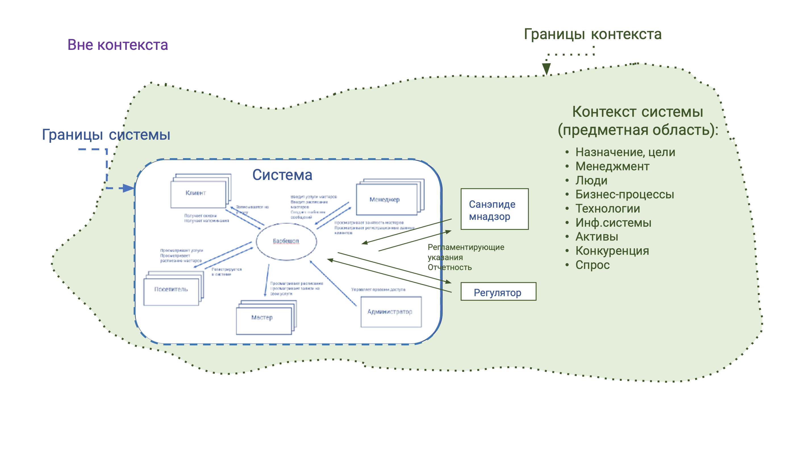
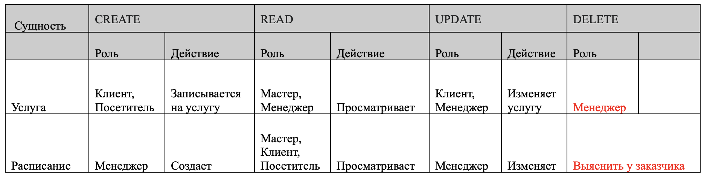
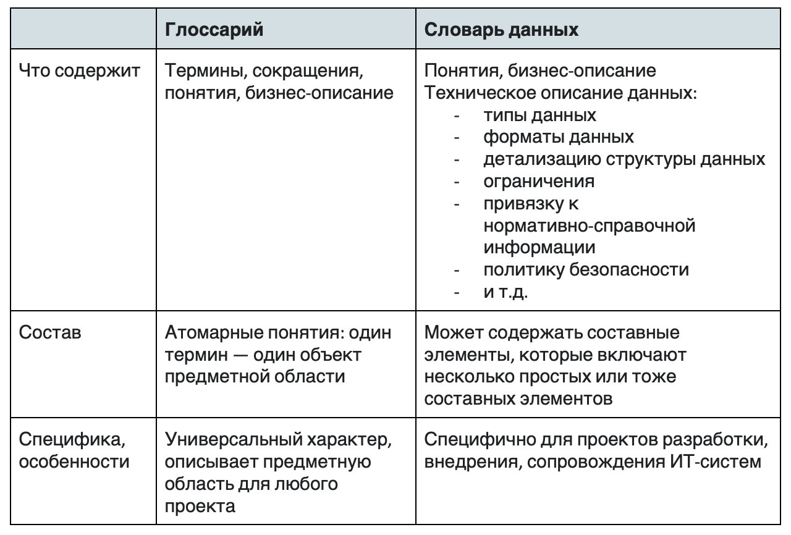

# Project Name

Description

## Contents

1. [Chapter I](#chapter-i) \
    1.1. [Preamble](#preamble)
2. [Chapter II](#chapter-ii) \
    2.1. [General rules](#general-rules)
3. [Chapter III](#chapter-iii) \
    [Theory](#theory)  
    3.1. [Предметная область](#предметная-область)  
    3.2. [Выделение сущностей и действий над ними](#выделение-сущностей-и-действий-над-ними)  
    3.3. [Проверка сущностей по CRUD](#проверка-сущностей-по-crud)  
    3.4. [Словарь данных](#словарь-данных)  
    3.5. [Построение ER-диаграммы](#построение-er-диаграммы)  
4. [Chapter IV](#chapter-iv) \
    4.1. [Задача 1](#задача-1)  
    4.2. [Задача 2](#задача-2)
5. [Chapter V](#chapter-v) \
    5.1. [Exercise 00](#exercise-00)  
    5.2. [Exercise 01](#exercise-01)  
    5.3. [Exercise 02](#exercise-02)  
    5.4. [Exercise 03](#exercise-03)  

<h2 id="chapter-i" >Chapter I</h2>
<h2 id="preamble">Preamble</h2>  

В предыдущем проекте для каждой разрабатываемой системы вы выявили бизнес-требования (высокоуровневую цель заказчика), познакомились с заинтересованными сторонами — теми, кто так или иначе заинтересован в системе, узнали, что такое контекстная диаграмма, как ее построить и как использовать. В этом проекте вы узнаете, что такое предметная область (domen), научитесь выявлять сущности предметной области, с которыми работает система. Узнаете, что такое модель CRUD, и выполните проверку выделенных вами сущностей предметной области по модели CRUD.   

**Литература:**
1. Карл Вигерс, Джой Битти, «Разработка требований к программному обеспечению» издание третье, дополненное.  
2. BABOK v3 «Руководство к своду знаний по бизнес-анализу» IIBA.  
3. Дин Леффингуэлл, Дон Уидриг «Принципы работы с требованиями к программному обеспечению».  

<h2 id="chapter-ii" >Chapter II</h2>  
<h2 id="general-rules">General rules</h2> 

1. Всю дорогу вас будет сопровождать чувство неопределенности и острого дефицита информации: это нормально. Не забывайте, что информация в репозитории и Google всегда с вами. Как и пиры, и Slack. Общайтесь. Ищите. Опирайтесь на здравый смысл. Не бойтесь ошибиться.  
2. Будьте внимательны к источникам информации. Проверяйте. Думайте. Анализируйте. Сравнивайте.   
3. Будьте внимательны к тексту задания. Перечитайте несколько раз.   
4. Читайте примеры внимательно. В них может быть что-то, что не указано в явном виде в самом задании.  
5. Вам могут встретиться несоответствия, когда что-то новое в условиях задачи или примере противоречит уже известному. Если встретилось такое — попробуйте разобраться. Если не получилось — запишите вопрос в открытые вопросы и выясните в процессе работы. Не оставляйте открытые вопросы неразрешенными.   
6. Если задание кажется непонятным или невыполнимым — так только кажется. Попробуйте его декомпозировать. Скорее всего, отдельные части станут понятными.   
7. На пути вам встретятся разные задания. Те, что помечены звездочкой (*) — подходят для более дотошных. Они с повышенной сложностью и не обязательны к выполнению. Но если вы их сделаете, то получите дополнительный опыт и знания.  
8. Не пытайтесь обмануть систему и окружающих. В первую очередь вы обманете себя.  
9. Есть вопрос? Спроси своего соседа справа. Если это не помогло — соседа слева.  
10. Когда пользуетесь помощью — всегда разбирайтесь до конца: почему, как и зачем. Иначе помощь не будет иметь смысла.  
11. Всегда делайте push только в ветку develop! Ветка master будет проигнорирована. Работайте в директории src.  
12. В вашей директории не должно быть иных файлов, кроме тех, что обозначены в заданиях.   

<h2 id="chapter-iii">Chapter III</h2>
<h2 id="theory">Theory</h2>
<h2 id="предметная-область">Предметная область</h2>    

**Предметная область (domain)** — часть реального мира, рассматриваемая в некоторых пределах.   
Это обстоятельства и условия, которые:  
- влияют на построение/изменение системы;  
- находятся под влиянием построения/изменения системы;  
- способствуют пониманию системы.  

К предметной области могут относиться:  
- Предметы реального мира;  
- Потоки данных;  
- Люди;  
- Организации;  
- Бизнес-процессы;  
- Идеи;  
- Технологии;  
- Цели и задачи;  
- Связи между любыми из перечисленного выше. 

Т.е. в предметную область входит не только система и внешние сущности, с ней связанные, но и все понятия, входящие в систему и так или иначе связанные с ней. Все, что входит в систему и окружает систему.   

На рис.1 показан контекст системы по задаче 1, зеленая область — контекст, прерывистая черта — границы контекста. В контекст мы выделили систему и то ее окружение (внешние сущности), которое непосредственно взаимодействуют с системой — это Регулятор и Санэпидемнадзор.    
Обратите внимание, что понятие Контекст не имеет прямого отношения к классу Context в программировании (предоставление доступа к базовым функциям приложения).    

Рисунок 1.  
  
Важные понятия предметной области — связи и зависимости. Именно знание понятий, понимание зависимостей, существующих в предметной области, и является ценным для аналитика, участвующего в разработке ИТ-систем. Но для того, чтобы хорошо разобраться в новой предметной области (новом домене), требуется немало времени. Поэтому знания предметной области или разных предметных областей довольно высоко ценится в ИТ-командах. Более подробно о методах погружения в новый домен здесь:  
1. [Ирина Гертовская “Погружение в новую предметную область. Чек-лист аналитика”](https://www.youtube.com/watch?v=XTyCgsKYHQo&t=4s);   
2. [Марина Давыдова “Мастер-класс: Исследование предметной области, как квест в работе аналитика”](https://www.youtube.com/watch?v=5r7-XfQ9FK8&list=PLQGve2f3j-H1s-w3V_w-pIvvGXuaoLvof&index=1&t=376s).  

<h2 id="выделение-сущностей-и-действий-над-ними">Выделение сущностей и действий над ними</h2>    

Есть простой способ выделения сущностей в предметной области: в текстах, описывающих проблемы и потребности, выделяем пары “существительное - глагол” или “существительное - отглагольное существительное”. Если существительное — объект реального мира (или виртуального мира, но еще не нашей системы) и встречается несколько раз — это кандидат в объекты (сущности) системы. Подробнее про порядок выделения сущностей:   

1. Выделение кандидатов в сущности. 
Выделяем, например, подчеркиванием, существительные и особенно пары существительные с глаголами или отглагольными существительными в текстах, описывающих задачу или проблему. Если над чем-то выполняются действия — это кандидат в объекты системы.  

2. Выделение сущностей. 
Выявляем из подчеркнутых существительных объекты, события — всё, что будет представлено в данных, над чем в нашей системе будут работать пользователи или сама система. Каждая сущность должна быть целостной и логически отделенной от всех других.  

3. Определение ключевых свойств каждой сущности. 
Определяем уникальные для каждой сущности свойства (атрибуты). Иногда в тексте это существительное, каким-то образом относящееся к существительному, выделенному как сущность. Уникальных может быть один или несколько атрибутов на каждую сущность.    

4. Определение связей между сущностями. 
Выявляем отношения между сущностями:  
- 1:1 (один-к-одному)   
- 1:М (один-ко-многим)  
- М:1 (многие-к-одному)  
- М:М (многие-ко-многим)  

5. Сопоставление атрибутов с сущностями.  
Сопоставляем атрибуты с сущностями с учетом того, что бизнес будет использовать данные. Выявляем возможные значения атрибутов и условия, ограничения.  

6. Назначение ключей и степени нормализации
Нормализация — метод организации моделей данных, в которых идентификаторы (ключи) назначаются группам данных для установления связей между ними без повторения данных.

7. Завершение, проверка модели данных.  
Моделирование — итеративный процесс, следует повторять и совершенствовать под потребности бизнеса.  

<h2 id="проверка-сущностей-по-CRUD">Проверка сущностей по CRUD</h2>    

Хорошим способом проверки полноты действий над сущностью является методика CRUD. Каждый экземпляр сущности должен быть проверен на:  
- создание (Create);  
- чтение (Read);  
- обновление (Update);  
- удаление (Delete).  

Возможно, какие-то из этих действий не должны выполняться над экземплярами отдельных сущностей, например, недопустимо удаление. Но это должно быть сознательное решение, даже если мы хотим иметь сведения о всех прошедших операциях, мы должны подумать — что делать, когда их станет слишком много. Возможно, вместо удаления мы можем выполнять действие Перевод в архив.  

На рисунке 2 - матрица CRUD для сущности Услуга в задаче 1.  
Иногда в процессе создания матрицы возникают вопросы, на которые нет ответа в тексте задачи. Мы должны уточнить эти вопросы у заказчика (если он есть) или придумать приемлемый вариант (гипотезу), отразить в дополнении к условию задачи (обязательно!) и продолжать анализ и разработку системы исходя из гипотезы.  

Подробнее про проверки по CRUD: [Ссылка](https://conf.uml2.ru/index.php?all_classes&class_id=trebovaniya-ne-menyayutsya-eto-vy-ikh-nedovyyavili--10-tekhnik-proverki-polnoty-trebovanii)

 

<h2 id="словарь-данных">Словарь данных</h2>    

**Словарь данных (Data Dictionary)** — средство, техника, позволяющая описать данные в бизнес-терминах, а также содержащая другие сведения о данных: информацию о типах и форматах данных, детализацию структур данных и нормативно-справочной информации и, возможно, других ограничений, например, по безопасности. Таким образом, словарь данных является одним из способов ведения метаданных.   

 

<h2 id="построение-er-диаграмма">Построение ER-диаграмма</h2>     

Один из способов визуализации предметной области — модель данных ER-диаграмма (диаграмма «Сущность — связь»).  
Вспомним, что модель — упрощенное описание действительности, позволяющее исследовать или обрабатывать объект. В зависимости от цели, стоящей перед командой, мы разрабатываем такие модели данных:  
- Концептуальная модель;  
- Логическая модель;  
- Физическая модель.  

**Концептуальная модель данных**  
Задает основные конструкции, описывает семантику домена. 
Часто используется на начальном этапе планирования, не содержит подробных сведений об атрибутах.
Включает в себя:  
- основные сущности;  
- связи.  

Разработка концептуальной модели данных — обязанность аналитика.  

**Логическая модель данных**. 
Отражает содержание и связи бизнеса, является расширением концептуальной модели. Представляет бизнес-информацию и определяется бизнес-правилами.
Определяется конкретной технологией манипулирования данными.   
Включает в себя:  
- сущности;  
- атрибуты;  
- ключи;  
- взаимосвязи.  

Логическую модель данных часто разрабатывает аналитик, но в сообществе с архитектором или разработчиком.  

**Физическая модель данных**. 
Обеспечивает разработку кода и всего, что с ним связано. Привязана к конкретной СУБД.
Включает в себя:
- все необходимые таблицы, столбцы, связи;
- свойства базы данных для физической реализации баз данных:  
    - производительность базы данных;  
    - стратегия индексации;  
    - физическое хранилище;  
    - денормализация.  

Физическую модель данных на базе логической модели разрабатывает разработчик или архитектор.   

<h2 id="chapter-iv">Chapter IV</h2>  
<h2 id="задача-1">Задача 01. Запись на стрижку (Sign up for a haircut)</h2>  

Руководство сети барбершопов приняло решение о внедрении системы, обеспечивающей онлайн-запись на прием. Основная цель — развитие бизнеса путем расширения клиентской базы за счет возможности онлайн-записи, а также снижение трудозатрат сотрудников и уменьшение ручного труда за счет автоматического информирования клиентов по каналам связи.   

Запись может осуществлять как зарегистрированный, так и незарегистрированный посетитель сайта. При записи можно выбрать тип услуги: парикмахерские или косметологические, а также саму услугу, мастера и время из свободных интервалов. Система должна обеспечивать автоматическую отправку напоминаний клиентам через выбранный клиентом канал связи (тг, вотсап, vk, смс) по настроенному менеджером расписанию. После получения услуги система предлагает клиенту оценить услугу и написать предложения по улучшению работы.   

Расписание мастеров и выполняемые каждым мастером услуги должен вводить менеджер, возможно это будет не один человек. Он же отвечает за актуальность расписания и при необходимости корректирует его, осуществляет связь с клиентами в ручном режиме, проставляет отметку о выполнении услуги, начисляет и принимает оплату, передает данные об оплате в бухгалтерию. Также менеджер может получать отчеты о выполненных услугах и просматривать отзывы клиентов.
Любой мастер имеет возможность посмотреть расписание и запись на свои услуги, отзывы клиентов. 

<h2 id="задача-2">Задача 02. Доставка заказов (Delivery of orders)</h2>   

В локдаун многие продуктовые магазины и предприятия питания резко увеличили объемы онлайн-продаж, и возросла потребность в быстрой доставке мелких партий товаров индивидуальным клиентам. Компания студентов собрались и решила создать стартап службы доставки. Идея состоит в том, чтобы оперативно получать информацию о заказах, месте и сроке комплектации, месте доставки, желаемых сроках доставки и раздавать инфо курьерам, которые будут получать заказ в месте комплектации и доставлять в место доставки.  

Решили развернуть онлайн-систему, куда стекаются заказы и откуда курьеры оперативно разбирают заказы для выполнения. На первом этапе решили собирать заказы от магазинов и предприятий питания любым доступным способом и вводить в систему в едином формате силами оператора, но разработать мобильное приложение для курьеров. Курьер должен иметь возможность просматривать информацию о заказах, выбирать заказ из свободных, бронировать его, забирать в точке выдачи и доставлять  клиенту.  

Результат своих действий курьер должен оперативно отражать в системе через мобильное приложение. Также в системе должен работать диспетчер, который контролирует курьеров и при необходимости переназначает заказы. Информация о поступивших заказах должна направляться в бухгалтерию (в другую ИТ-систему) для расчета с поставщиками заказов за доставку. Также в бухгалтерию должна направляться информация о доставке заказа, где будет производиться расчет оплаты курьеров. Начисленная оплата должна передаваться в систему и отражаться в личном кабинете курьера. И еще запланировано рабочее место администратора, регистрирующего курьеров и назначающего всем права доступа.

<h2 id="chapter-v">Chapter V</h2>  
<h2 id="exercise-00">Exercise 00. Entity detection (Выявление сущностей)</h2>   

Для каждой задачи:  
1. Определить не менее 7 сущностей (руководствуясь порядком выделения сущностей) с которыми будет работать система.  
2. Определить для каждой сущности название, указать назначение.  
3. Определить для каждой сущности основные (ключевые) атрибуты.  
4. Указать ваши ответы в turn-in файле ex00_<префикс продукта>_entity.xlsx.  

<h2 id="exercise-01">Exercise 01. Entity validation by CRUD (Проверка сущности по CRUD)</h2>     

Для задачи 1:  

1. Для каждой сущности провести проверку полноты операций по CRUD.  
2. Для проверки по CRUD отразить в таблице (подобной приведенной на рис. 2 в п.3. Проверка сущностей по
 CRUD):  
    a. Указать в таблице роли стейкхолдеров и действия, при которых выполняется операция CRUD.  
    b. В случае, если из условий задачи или интервью не понятно, кто и когда выполняет операцию, предложить гипотезу или указать потребность уточнения у стейкхолдеров (выделить цветом).  
3. Указать ваши ответы в turn-in файле ex01_<префикс продукта>_crud.xlsx.

<h2 id="exercise-02">Exercise 02. Building a data dictionary (Построение словаря данных)</h2>   

Для каждой задачи:  
1. Построить словарь данных.  
2. Включить в словарь данных название сущности, мнемонику, описание понятия, тип данных, обязательность.  
3. Разместите таблицу в turn-in файле ex02_<префикс продукта>_dict.xxx (xxx — расширение файла).  

<h2 id="exercise-03">Exercise 03. Building a logical data model (Построение логической модели данных)</h2>    

Для каждой задачи:  
1. Построить ER-диаграмму — логическую модель данных.  
2. Включить в ER-диаграмму выбранные Вами сущности, поддерживающие справочники и развязочные таблицы для связей М:М.  
3. В ER-диаграмме указать множественность связей между сущностями.  
4. Описать глаголами связи между сущностями в ER-диаграмме.  
5. Разместить диаграмму в turn-in файле ex03_<префикс продукта>_model.xxx (xxx — расширение файла).  

